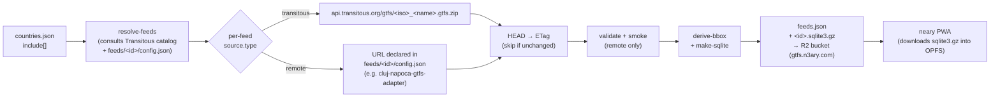

# neary-gtfs

The app-side companion to a GTFS feed: turns one or more upstream
`.gtfs.zip` URLs into the two things the [neary](https://github.com/ciotlosm/neary)
PWA actually needs to render a city:

1. A `.sqlite3.gz` blob per feed (the app's in-OPFS data store).
2. A single `feeds.json` registry with everything else the app reads at
   launch — bbox, center, timezone, agencies, license, realtime URLs,
   optional Tranzy mapping, and the upstream ETag we use for
   change-detection.

> [!NOTE]
> **Live registry**: [`https://gtfs.n3ary.com/feeds.json`](https://gtfs.n3ary.com/feeds.json) (Cloudflare R2 via custom domain)

The repo deliberately does **not** produce GTFS — it consumes it. Where
the zip comes from is a per-feed detail (Transitous mirror, sister-repo
adapter, …) and lives in [`feeds/<id>/config.json`](feeds/).

## What it produces

Published nightly to the `neary-gtfs` Cloudflare R2 bucket by
[`.github/workflows/daily.yml`](.github/workflows/daily.yml), served
via the custom domain `gtfs.n3ary.com`:

```
https://gtfs.n3ary.com/feeds.json
https://gtfs.n3ary.com/<id>.sqlite3.gz   ← one per feed listed in feeds.json
```

The raw `.gtfs.zip` is not republished — its upstream URL is in
`source.upstream_url`, so any external GTFS tooling can pull it from
the original publisher.

`feeds.json` is Ajv-validated against
[`schemas/feeds.schema.json`](schemas/feeds.schema.json) (draft-2020)
on every build, so a malformed entry fails before publish.

## How a feed gets there



Two source flavors today:

| `source.type` | Where the zip comes from | When to use |
|---|---|---|
| `transitous` | `api.transitous.org/gtfs/<iso>_<name>.gtfs.zip` | Default. Transitous's mirror is fine. |
| `remote` | URL in `feeds/<id>/config.json` `source.url` | Transitous's mirror is stale and a sister repo publishes a better zip for the same operator (e.g. [`cluj-napoca-gtfs-adapter`](https://github.com/ciotlosm/cluj-napoca-gtfs-adapter)). |

A `feeds/<id>/config.json` is also where you overlay app-side metadata
on top of either source — `realtime` URLs, `tranzy` mapping, license
text, a `smoke` contract block. See
[`feeds/cluj-napoca/config.json`](feeds/cluj-napoca/config.json) for a
worked example.

## Pipeline

Daily orchestrator + helpers live in [`src/pipeline/`](src/pipeline/README.md);
that README has the step-by-step. Run locally with `npm run pipeline`.

## Structure

The flow is in the [Mermaid diagram above](#how-a-feed-gets-there);
`ls -R src/pipeline feeds/` shows the file tree.

Two conceptual entry points worth knowing:

- [`countries.json`](countries.json) — single source of truth for what
  we publish (`include[]` lists Transitous source names).
- [`feeds/<id>/config.json`](feeds/) — per-feed override. Optional; drop
  one in to swap the source URL and/or overlay app-side metadata.

## Local development

See [DEVELOPMENT.md](DEVELOPMENT.md).

## License

Schedule data © its respective transit operators (per-feed
`license.attribution_text` in `feeds.json`). Generated for public transit
information purposes.
