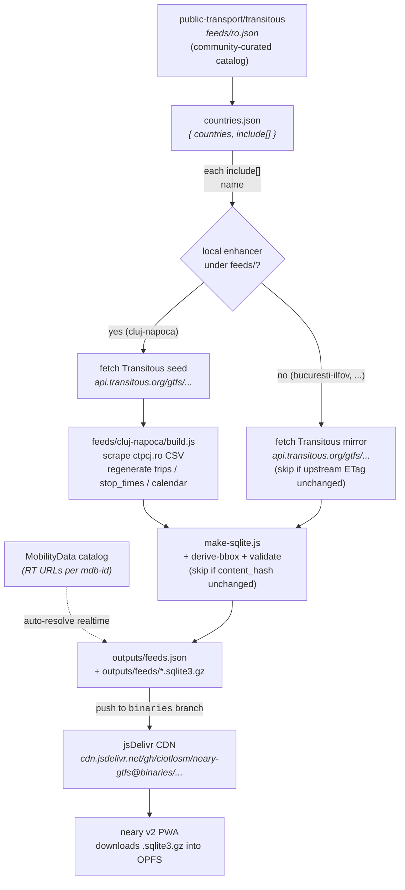

# neary-gtfs

> Multi-feed GTFS publisher for the [neary](https://github.com/ciotlosm/neary)
> v2 PWA. Live registry: [`feeds.json`](https://cdn.jsdelivr.net/gh/ciotlosm/neary-gtfs@binaries/feeds.json).

Acts as a **thin curation layer on top of Transitous + MobilityData**:
fetches their well-validated zips, optionally enhances them (Cluj gets
fresh CTP CSV-scraped schedules), converts to SQLite for fast in-browser
querying, and publishes one app-facing `feeds.json` registry.

## How it layers



Three publishers (Transitous, MobilityData, us), one app-facing
registry — the v2 app doesn't have to know any of this. It fetches
`feeds.json`, picks the user's feed by GPS bbox, downloads one
`.sqlite3.gz` blob. Done.

## What it produces

Published nightly to the `binaries` branch by
[`.github/workflows/daily.yml`](.github/workflows/daily.yml):

| File | Source | Consumer |
|------|--------|----------|
| `feeds.json` | pipeline | neary v2 app (single registry) |
| `feeds/<id>.sqlite3.gz` | [`make-sqlite.js`](src/pipeline/make-sqlite.js) | neary v2 app (OPFS) — **always present** |
| `feeds/<id>.gtfs.zip` | local enhancement ([`feeds/<id>/build.js`](feeds/)) | external GTFS tools — **only for `source.type === 'build'` feeds**; mirrors are accessible via Transitous's own URL |

> [!TIP]
> Live registry (single source of truth for what's currently published):
> [`https://cdn.jsdelivr.net/gh/ciotlosm/neary-gtfs@binaries/feeds.json`](https://cdn.jsdelivr.net/gh/ciotlosm/neary-gtfs@binaries/feeds.json)

> [!NOTE]
> `feeds.json` is Ajv-validated against
> [`schemas/feeds.schema.json`](schemas/feeds.schema.json) (draft-2020).
> Locally-built zips also get a light Node-side structural check
> ([`src/pipeline/validate.js`](src/pipeline/validate.js)) — Transitous
> mirrors are trusted to upstream validation.

## Pipeline

`npm run pipeline` (`src/pipeline/build-all.js`):

1. `resolve-feeds.js` — read `countries.json` `include[]` as the
   **single source of truth** for which feeds to publish. For each
   entry: fetch the matching source from Transitous's `feeds/<iso>.json`.
   If a `feeds/<id>/config.json` declares `enhances: "<name>"` matching
   that Transitous source, promote it to an enhanced build; otherwise
   plain mirror.
2. For each feed:
   - `fetch-gtfs.js`:
     - **Plain mirror**: download
       `api.transitous.org/gtfs/<iso>_<name>.gtfs.zip`
     - **Enhanced build**: download the same Transitous zip as seed,
       hand its path to `feeds/<id>/build.js` via `NEARY_SEED_ZIP`;
       the script mutates the zip and writes the final
       `outputs/feeds/<id>.gtfs.zip`
   - `derive-bbox.js` — `unzip -p` the zip's `stops.txt` / `agency.txt` /
     `feed_info.txt` → bbox, agencies, validity dates
   - `make-sqlite.js` — `.zip` → `.sqlite3.gz`
3. `make-app-registry.js` — write `outputs/feeds.json` (Ajv-validated).

App consumes from (via jsDelivr):
```
https://cdn.jsdelivr.net/gh/ciotlosm/neary-gtfs@binaries/feeds.json
```

### Locally-enhanced feeds

Each subdirectory of `feeds/` documents its own enhancement:

- [`feeds/cluj-napoca/`](feeds/cluj-napoca/README.md) — CTP Cluj
  schedule enhancement (daily CSV scrape on top of the Transitous seed)

> [!TIP]
> To add another locally-enhanced feed, see
> [DEVELOPMENT.md § Adding a feed](DEVELOPMENT.md#adding-a-feed).
> No JS edits needed — drop a `feeds/<id>/config.json` with
> `enhances: "<TransitousName>"` + a `build.js` and the pipeline
> picks it up.

## Structure

```
countries.json                # { countries: [iso], include: [transitous source names] }
schemas/feeds.schema.json     # JSON Schema for outputs/feeds.json
src/pipeline/
  build-all.js                # orchestrator (skip-on-unchanged for both paths)
  resolve-feeds.js            # countries.json + Transitous → feed list
  fetch-gtfs.js               # build local or fetch upstream
  derive-bbox.js              # zip → bbox + agencies + validity + timezone
  make-sqlite.js              # zip → .sqlite3.gz
  make-app-registry.js        # → outputs/feeds.json (Ajv-validated)
  validate.js                 # light spec-shape check for locally-built zips
  lib/
    csv.js                    # tiny shared GTFS-CSV parser
    http.js                   # shared UA + fetchJson/fetchToFile
    mdb-rt.js                 # resolve realtime URLs via MobilityData catalog
    zip-hash.js               # stable content-hash for change-detection on builds
feeds/
  cluj-napoca/                # see feeds/cluj-napoca/README.md
.github/workflows/daily.yml   # cron 00:30 UTC + push to main + workflow_dispatch
```

## Local development

See [DEVELOPMENT.md](DEVELOPMENT.md).

## License

Schedule data © CTP Cluj-Napoca. Generated for public transit information purposes.
