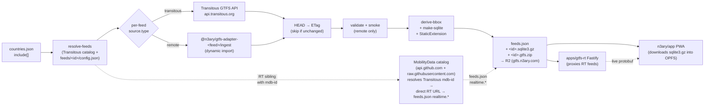

# Data pipeline

System-level view of how GTFS data flows from upstream sources to the three
artifacts this repo publishes. The README is an index that points here.

## The three artifacts

| Artifact | Format | Who consumes | Where it lives |
|---|---|---|---|
| Raw GTFS Schedule zip | `.gtfs.zip` — public GTFS Schedule spec, no extensions | External GTFS tooling (onebusaway, transit planners, validators) | `<id>-<hash12>.gtfs.zip` on R2 |
| SQLite blob | `.sqlite3.gz` — public spec + per-feed extensions (e.g. cluj adapter's `networks.network_color`, `_neary_config` table) | [n3ary/app](https://github.com/n3ary/app) PWA in OPFS | `<id>-<hash12>.sqlite3.gz` on R2 |
| GTFS-RT protobuf | HTTP-served GTFS-Realtime protobuf (`vehicle_positions`, `trip_updates`, `service_alerts`) | [n3ary/app](https://github.com/n3ary/app) live reconciler | `apps/gtfs-rt` Fastify server, deployed standalone |

**Extensions stay in the sqlite blob.** Per-feed adapter knowledge (the
cluj adapter's route-color fixup, the `_neary_config` key/value table,
etc.) is applied via `StaticExtension` hooks that run **after** the spec
DDL has loaded the zip. The published `.gtfs.zip` is always the adapter's
raw output — never annotated with extension tables or columns.

## Pipeline stages



### Stage-by-stage

1. **`countries.json` → `resolve-feeds`**: the canonical list of Transitous source names this repo publishes (`include[]`). For each source, `resolve-feeds.js` looks at the Transitous catalog (`raw.githubusercontent.com/public-transport/transitous/main/feeds/<iso>.json`), checks the whitelist, and resolves per-feed overrides from `feeds/<id>/config.json`.
2. **`source.type` dispatch**: three source flavors. `transitous` (plain mirror from `api.transitous.org/...`), `remote` (upstream URL pulled directly), `adapter` (dynamic-import `${publisher}/ingest` from `feeds/<id>/config.json`'s `source.publisher`).
3. **GTFS zip acquisition with ETag skip**: `fetch-gtfs.js` HEADs the upstream URL; if the ETag matches the cached one, the zip is skipped. Pipeline stays under 1 minute when nothing changed. Adapter-driven feeds skip this step entirely (the adapter produces the zip directly).
4. **`validate` + smoke (remote only)**: `validate.js` confirms a manifest of basic invariants; for `remote` sources, `smoke-remote.js` parses a few CSVs through the production parser to catch regressions in upstream format.
5. **`derive-bbox` + `make-sqlite` + `StaticExtension`**: computes the feed's bounding box (consumed by the app to suggest feeds that cover the user's location); converts each CSV to a SQLite table; calls the adapter's `staticExtension(feedConfig)` factory for any per-feed extras (columns, tables, computed-value hooks).
6. **`feeds.json` + `*.sqlite3.gz` + `*.gtfs.zip` → R2**: published to the `neary-gtfs` bucket via the S3-compatible R2 API. All three filenames are content-addressed by sha256 (`<id>-<hash12>.<ext>`) so the cache TTL never serves stale bytes at a known URL. See [ops/secrets-and-deploy.md](../ops/secrets-and-deploy.md) for credentials.
7. **MobilityData catalog → realtime URLs**: when a Transitous source has an RT sibling with an `mdb-id`, `mdb-rt.js` resolves it to a direct RT URL via the MobilityData catalog on GitHub (`api.github.com` git tree + `raw.githubusercontent.com/...mobility-database-catalogs/`). The resolved URLs land in `feeds.json` `realtime.*` so the consumer knows where to fetch `vehicle_positions`.
8. **`apps/gtfs-rt` Fastify server**: a separate process that proxies the `realtime.*` URLs through a single Fastify HTTP endpoint per feed, exposing them as standard GTFS-RT protobuf over HTTP. The PWA hits this server instead of the upstream providers directly (one stable DNS, one auth model, one set of rate-limit knobs).
9. **`n3ary/app` PWA**: the consumer side. At launch it fetches `feeds.json`, picks a feed (or auto-picks by GPS), downloads `*.sqlite3.gz`, stores in OPFS, then starts polling the `gtfs-rt` proxy for live `vehicle_positions`.

## Source flavors

| `source.type` | Where the zip comes from | When to use |
|---|---|---|
| `transitous` | `api.transitous.org/gtfs/<iso>_<name>.gtfs.zip` | Default. Transitous's mirror is fine. |
| `remote` | URL in `feeds/<id>/config.json` `source.url` | Transitous's mirror is stale and an upstream URL publishes a better zip for the same operator. |
| `adapter` | Dynamic-import `${source.publisher}/ingest` (e.g. `@n3ary/gtfs-adapter-cluj-napoca/ingest`) | Per-feed reconciliation that the generic pipeline can't do (e.g. merging Tranzy static + CTP CSV timetables). Adds zero per-feed code to this repo — see [n3ary/gtfs-adapters](https://github.com/n3ary/gtfs-adapters). |

A `feeds/<id>/config.json` is also where you overlay app-side metadata on top of either source — `realtime` URLs, license text, a `smoke` contract block, the adapter package name (`source.publisher`), and any env-var secrets the adapter needs (`secrets[]`). See [`feeds/cluj-napoca/config.json`](../../feeds/cluj-napoca/config.json) for a worked example.

## What this repo produces

Published nightly to the `neary-gtfs` Cloudflare R2 bucket by [`.github/workflows/daily.yml`](../../.github/workflows/daily.yml), served via the custom domain `gtfs.n3ary.com`:

```
https://gtfs.n3ary.com/feeds.json
https://gtfs.n3ary.com/<id>-<hash12>.sqlite3.gz   ← one per feed listed in feeds.json (spec + per-feed extensions)
https://gtfs.n3ary.com/<id>-<hash12>.gtfs.zip    ← one per feed (public GTFS Schedule spec only — no extensions)
```

Live `vehicle_positions` / `trip_updates` / `service_alerts` are served by the `apps/gtfs-rt` Fastify server, deployed independently from the static pipeline.

`feeds.json` is Ajv-validated against [`apps/gtfs-static/src/schema/feeds.schema.json`](../../apps/gtfs-static/src/schema/feeds.schema.json) (draft-2020) on every build, so a malformed entry fails before publish.

## Cross-references

- Pipeline stage implementation — [`apps/gtfs-static/src/README.md`](../../apps/gtfs-static/src/README.md)
- Repository layout and conventions — [`../README.md`](../README.md) (the slimmed landing page)
- Secrets + R2 setup — [`../ops/secrets-and-deploy.md`](../ops/secrets-and-deploy.md)

<!-- The R2 bucket is named `neary-gtfs` for historical reasons. We renamed the GitHub repo from `n3ary/gtfs` → `n3ary/gtfs-sql` → `n3ary/gtfs-publisher` but kept the bucket name (and CDN URL `gtfs.n3ary.com`) to avoid breaking external links. -->
