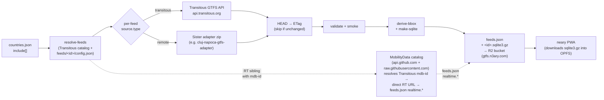

# Data pipeline

System-level view of how GTFS data flows from upstream sources to the published artifacts. The README is an index that points here.

## Pipeline stages



### Stage-by-stage

1. **`countries.json` → `resolve-feeds`**: the canonical list of Transitous source names this repo publishes (`include[]`). For each source, `resolve-feeds.js` looks at the Transitous catalog (`raw.githubusercontent.com/public-transport/transitous/main/feeds/<iso>.json`), checks the whitelist, and resolves per-feed overrides from `feeds/<id>/config.json`.
2. **`source.type` switch**: two source flavors today. Transitous (`api.transitous.org/gtfs/<iso>_<name>.gtfs.zip`) for plain mirrors; `remote` for feeds sourced from a sister adapter (e.g. cluj-napoca-gtfs-adapter).
3. **GTFS zip download with ETag skip**: `fetch-gtfs.js` HEADs the upstream URL; if the ETag matches the cached one, the zip is skipped. Pipeline stays under 1 minute when nothing changed.
4. **`validate` + smoke (remote only)**: `validate.js` confirms a manifest of basic invariants; for remote sources, `smoke-remote.js` parses a few CSVs through the production parser to catch regressions in upstream format.
5. **`derive-bbox` + `make-sqlite`**: computes the feed's bounding box (consumed by the app to suggest feeds that cover the user's location); converts each CSV to a SQLite table.
6. **`feeds.json` + `*.sqlite3.gz` → R2**: published to the `neary-gtfs` bucket via the S3-compatible R2 API. See [ops/secrets-and-deploy.md](../ops/secrets-and-deploy.md) for credentials.
7. **MobilityData catalog → realtime URLs**: when a Transitous source has an RT sibling with an `mdb-id`, `mdb-rt.js` resolves it to a direct RT URL via the MobilityData catalog on GitHub (`api.github.com` git tree + `raw.githubusercontent.com/...mobility-database-catalogs/`). The resolved URLs land in `feeds.json` `realtime.*` so the consumer knows where to fetch `vehicle_positions`.
8. **`neary` PWA**: the consumer side. At launch it fetches `feeds.json`, picks a feed (or auto-picks by GPS), downloads `*.sqlite3.gz`, stores in OPFS, then starts polling the RT URL the MDB step wrote into `feeds.json`.

## Source flavors

| `source.type` | Where the zip comes from | When to use |
|---|---|---|
| `transitous` | `api.transitous.org/gtfs/<iso>_<name>.gtfs.zip` | Default. Transitous's mirror is fine. |
| `remote` | URL in `feeds/<id>/config.json` `source.url` | Transitous's mirror is stale and a sister repo publishes a better zip for the same operator (e.g. [`cluj-napoca-gtfs-adapter`](https://github.com/ciotlosm/cluj-napoca-gtfs-adapter)). |

A `feeds/<id>/config.json` is also where you overlay app-side metadata on top of either source — `realtime` URLs, license text, a `smoke` contract block. See [`feeds/cluj-napoca/config.json`](../../feeds/cluj-napoca/config.json) for a worked example.

## What this repo produces

Published nightly to the `neary-gtfs` Cloudflare R2 bucket by [`.github/workflows/daily.yml`](../../.github/workflows/daily.yml), served via the custom domain `gtfs.n3ary.com`:

```
https://gtfs.n3ary.com/feeds.json
https://gtfs.n3ary.com/<id>.sqlite3.gz   ← one per feed listed in feeds.json
```

The raw `.gtfs.zip` is not republished — its upstream URL is in `source.upstream_url`, so any external GTFS tooling can pull it from the original publisher.

`feeds.json` is Ajv-validated against [`packages/gtfs-static/src/schema/feeds.schema.json`](../../packages/gtfs-static/src/schema/feeds.schema.json) (draft-2020) on every build, so a malformed entry fails before publish.

## Cross-references

- Pipeline stage implementation — [`packages/gtfs-static/src/README.md`](../../packages/gtfs-static/src/README.md)
- Repository layout and conventions — [`../README.md`](../README.md) (the slimmed landing page)
- Secrets + R2 setup — [`../ops/secrets-and-deploy.md`](../ops/secrets-and-deploy.md)

<!-- The R2 bucket is named `neary-gtfs` for historical reasons. We renamed the GitHub repo to `n3ary/gtfs` but kept the bucket name (and CDN URL `gtfs.n3ary.com`) to avoid breaking external links. -->
