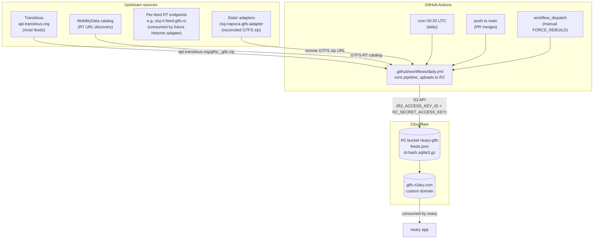

# Infrastructure

Every cloud / external piece this repo's pipeline touches, in one diagram + one table. Cross-references the relevant docs for detail; this doc is the **index** for "what runs where and what breaks if it dies".

Cross-refs:
- Pipeline development + CI workflow — [../../DEVELOPMENT.md](../../DEVELOPMENT.md)
- Pipeline anatomy — [../../src/pipeline/README.md](../../src/pipeline/README.md)
- Sister repo that consumes the outputs — [neary](https://github.com/ciotlosm/neary) docs/architecture/infrastructure.md
- Sister adapter for Cluj — [cluj-napoca-gtfs-adapter](https://github.com/ciotlosm/cluj-napoca-gtfs-adapter) docs/architecture.md

## Diagram

## Component table

| Component | Role | Owner | Cost driver | Failure impact |
|---|---|---|---|---|
| **GitHub Actions — cron 00:30 UTC** | Daily rebuild of all feeds after Transitous's ~00:00 UTC daily import | GitHub | Free tier (2 000 min/month) | Stale data after the first missed day |
| **GitHub Actions — push to main** | Rebuild on PR merge to `main` (docs-only PRs skipped via `paths-ignore`) | GitHub | Free tier | (intended no-op via content-addressed cache) |
| **GitHub Actions — workflow_dispatch** | Manual `FORCE_REBUILD=true` rebuild — used after pipeline code changes that affect output | GitHub | Free tier | — |
| **GitHub Actions — PR validation** | `npm run pipeline` + `npm test` + `npm run lint` on every PR | GitHub | Free tier | PR can't merge |
| **Cloudflare R2** — `neary-gtfs` bucket | Stores `feeds.json` + `<id>-<hash12>.sqlite3.gz` | Cloudflare | $0.015/GB/month + $0.36/M Class A operations | Sister repo can't fetch data |
| **Custom domain** — `gtfs.n3ary.com` → R2 | Public URL for the R2 bucket | Cloudflare | Free with R2 | Data URL down |
| **Transitous** (`api.transitous.org`) | Upstream GTFS zip mirror for most feeds | Transitous | Free | Most feeds missing |
| **MobilityData catalog** | Auto-discovers GTFS-RT URLs from the MobilityData feed registry | MobilityData | Free | RT URLs may be wrong/missing |
| **Sister adapters** (e.g. [cluj-napoca-gtfs-adapter](https://github.com/ciotlosm/cluj-napoca-gtfs-adapter)) | Reconciled GTFS zip for specific feeds; consumed via `feeds/<id>/config.json` `source.type=remote` | Each adapter's repo | (their infra) | Feeds sourced from that adapter stale |
| **Per-feed upstream RT endpoints** (e.g. `cluj-rt-feed.gtfs.ro`) | Live protobuf per operator (consumed by future Hetzner RT adapter — see [neary-gtfs#34](https://github.com/ciotlosm/neary-gtfs/issues/34)) | Operators | Free | (Future) live RT feed broken for that operator |
| **neary** (sister repo) | Consumer of the published artifacts | [neary repo](https://github.com/ciotlosm/neary) | (its own infra) | Data freshness signal missing |

## Secrets + variables (GitHub repo settings)

Driving the R2 upload (defined in [DEVELOPMENT.md](../../DEVELOPMENT.md) lines 124-128):

| Name | Type | Purpose |
|---|---|---|
| `R2_ACCESS_KEY_ID` | secret | R2 S3-compatible token, scoped Object Read+Write on `neary-gtfs` bucket |
| `R2_SECRET_ACCESS_KEY` | secret | (paired with access key) |
| `R2_S3_ENDPOINT` | variable | S3-compatible endpoint URL |
| `R2_BUCKET` | variable | Bucket name (currently `neary-gtfs`) |
| `R2_PUBLIC_BASE_URL` | variable | Public base URL for `Cache-Control: public, max-age=31536000, immutable` |

Uploads set `Cache-Control: public, max-age=300` on `feeds.json` and each `<id>.sqlite3.gz` — propagation stays bounded to ≤ 5 min per publish, matches the previous GitHub-raw behavior the sister repo's consumer relied on.

## Planned: Hetzner RT adapter (tracking [neary-gtfs#34](https://github.com/ciotlosm/neary-gtfs/issues/34))

When the producer monorepo ships, the always-on RT adapter moves to a Hetzner CX22 (€4.50/month fixed), with a thin Cloudflare Worker in front for cache. Until then, the upstream RT endpoints are NOT consumed by this repo — they're consumed (passthrough, no cleanup) by the consumer's Cloudflare Pages Function. Spec for the future adapter: [neary docs/gtfs-rt-contract.md](https://github.com/ciotlosm/neary/blob/main/docs/specs/gtfs-rt-contract.md).